# 千词斩使用指南

千词斩是一个轻量、灵活的背单词软件。它设计的初衷是为了便于背诵如题单这样琐碎的单词集。因此，千词斩的操作都是基于单词本的。

我们设计了两种单词本：`一般单词本`和`长期单词本`。一般单词本用于储存单词不多且短期使用的单词集，如每日背诵的题单。长期单词本用于储存单词较多且需要长期使用的单词集，如整个高中的单词。

## 安装前置软件

必须安装前置软件才能正常使用千词斩。所有前置软件的安装包都在千词斩安装包中，根据教程进行安装即可。

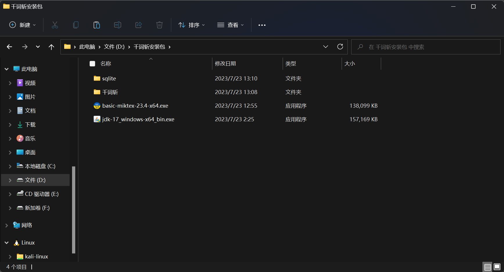

### Java环境

本软件需要Java环境以运行软件本体。如果您的电脑里已经安装了Java，请确保其版本在`Java 11`及以上，否则请安装我们提供的`jdk 17`并修改环境变量。

安装Java环境非常简单。第一步是双击打开安装包文件夹内的`jdk-17_windows-x64_bin.exe`。其效果如图。

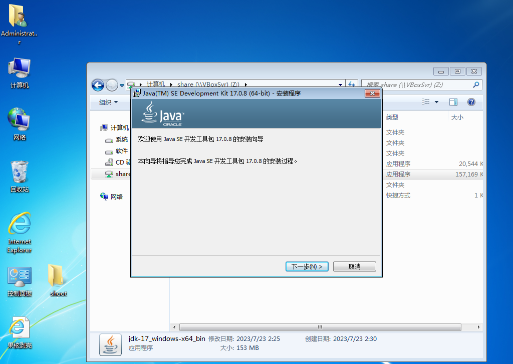

点击`下一步`，如图。

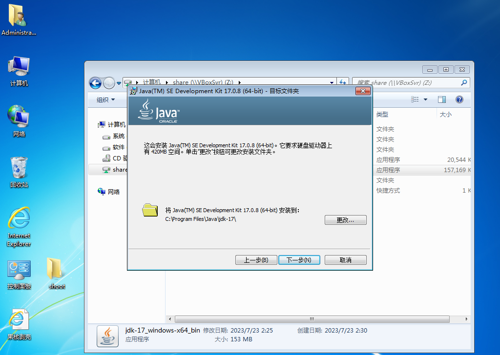

在这里可以修改安装目录。推荐不要做任何修改，点击`下一步`即可。等待片刻后即可完成安装，效果如图。

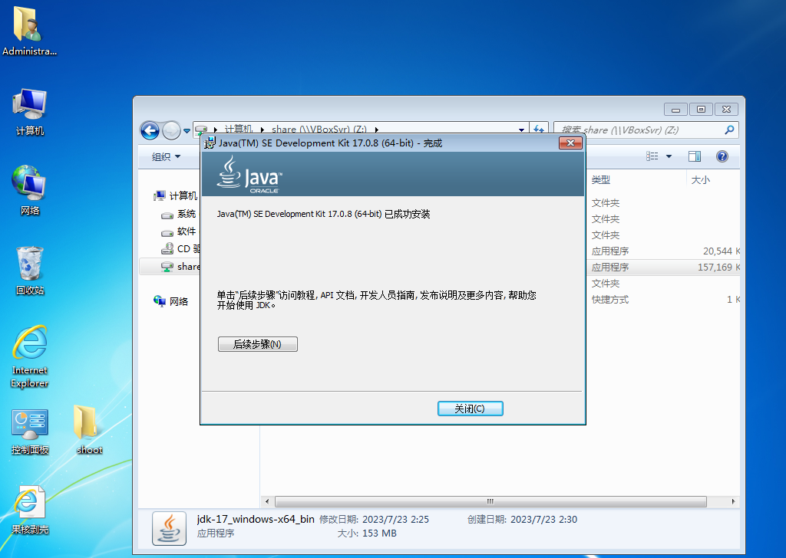

至此就完成了Java的安装。

### sqlite

sqlite3是本软件用于储存单词的数据库。

我们编写了sqlite3的安装脚本。只需要点开安装包文件夹下的`sqlite`文件夹，双击`install.bat`文件即可完成安装。

至此就完成了必须软件的安装。

### MikTex

MikTex用于将单词本导出为PDF文件的功能中。它的安装是`非必选`的。

注意，MikTex仅支持Windows10及更高版本。Windows7用户请考虑安装TexLive或者等待本软件更新Excel支持。

如果要安装MikTex，请双击打开安装包文件夹下的`basic-miktex-23.4-x64.exe`文件，如图。

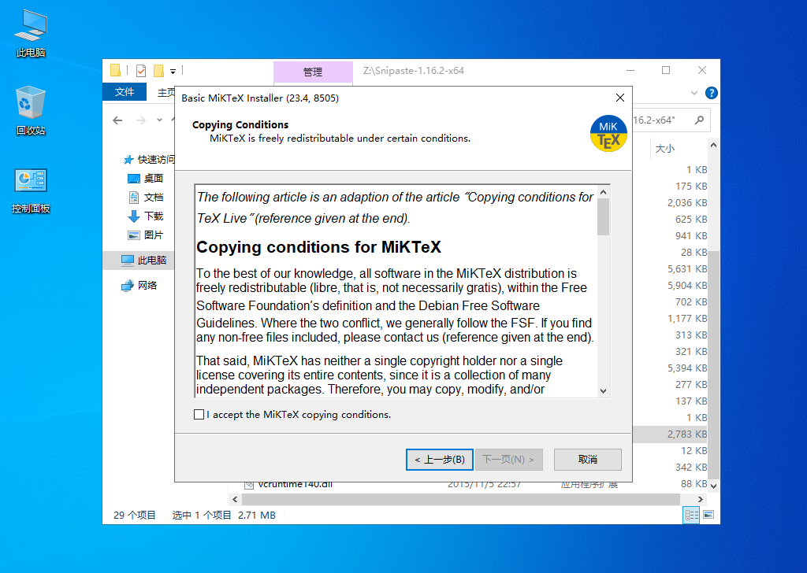

在选中`I accept...`后点击`下一页`，如图。

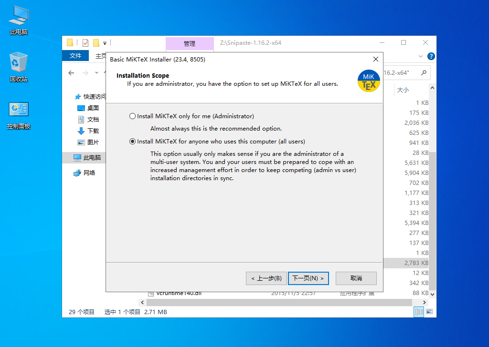

点击`下一页`，如图。

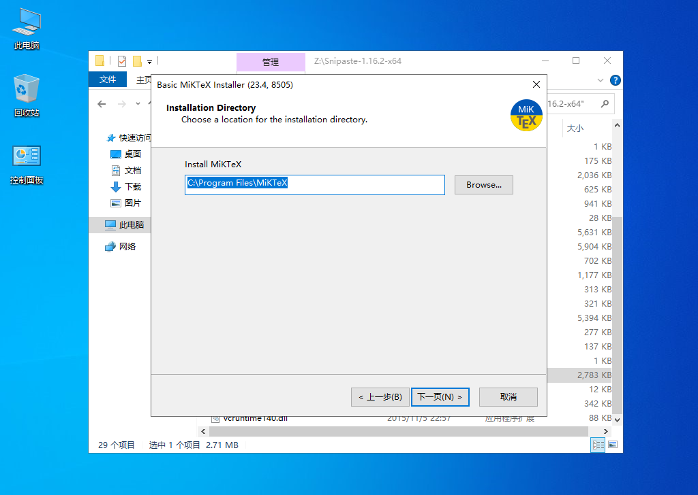

此处可以修改安装路径。在修改完成后请点击`下一页`，如图。

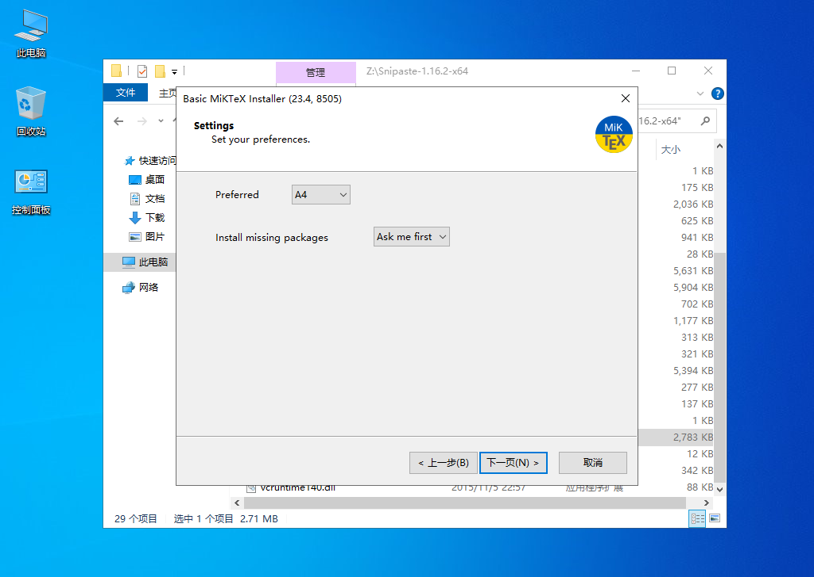

点击`下一页`，如图。

点击`Start`后请等待片刻直至安装完成。随后一直点击`下一页`直至结束即可。

## 打开软件

在安装包文件夹下有文件夹`千词斩`，点开后有一个叫做`千词斩-jar-with-dependencies.jar`的文件，双击即可打开千词斩，如图。

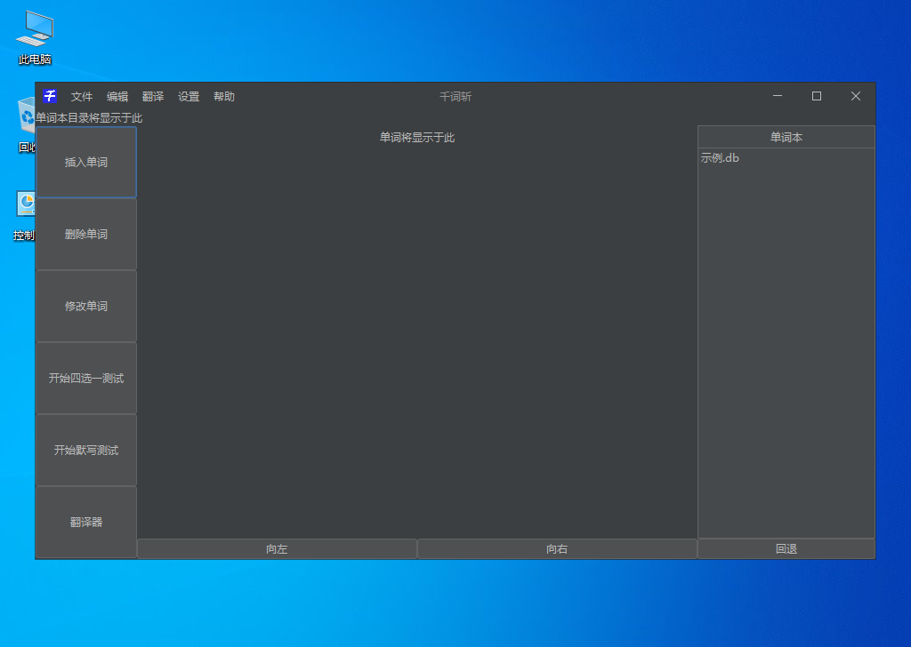

## 新建和进入单词本

若要新建单词本，请点击菜单栏中`文件`中的`新建`，在出现的对话框中输入单词本的名称即可创建一个新的单词本。创建好后程序会自动进入新建的单词本。效果如图所示。

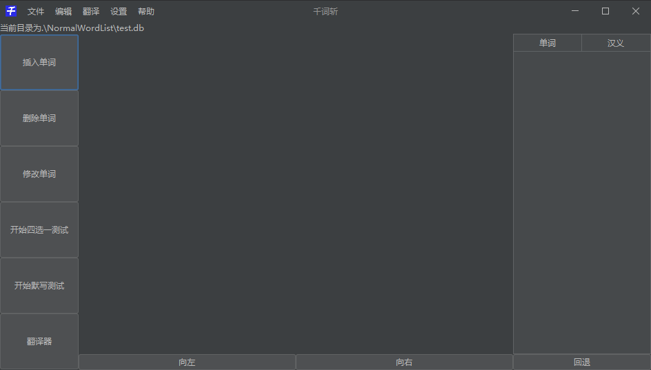

点击右下角的`回退`，即可从单词本界面回到首页。在回退至首页后，会看到右侧`单词本`列表中多了新建的单词本。

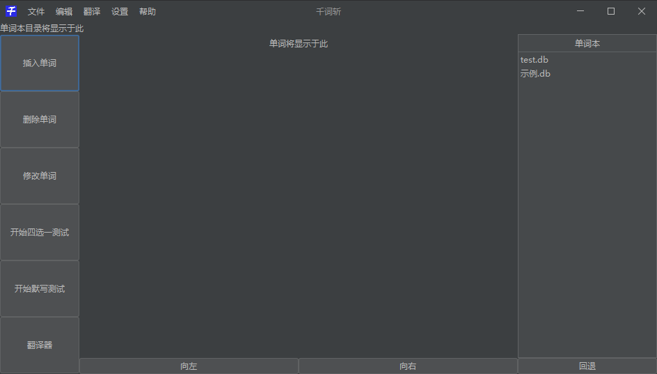

若想进入单词本，点击右侧`单词本`列表中的单词本即可。

若想进入长期单词本，点击`文件菜单栏`中的`打开长期单词本`即可进入。

## 单词的增删查改

在进入单词本后，点击左侧的`插入单词`即可插入新单词。插入单词对话框及其示例如图。

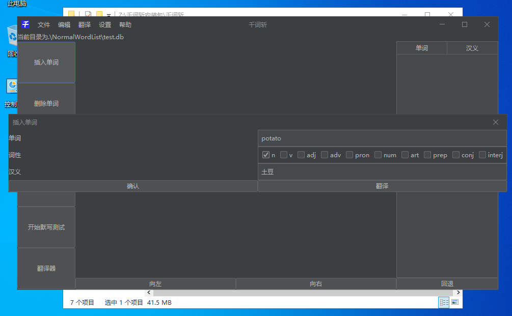

插入单词必须给出单词本身和词性（如果没有背诵词性的需求的话，那么可以默认为名词），汉义是可选的。在输入完这些信息后，点击`确定`即可完成录入单词。此时可以看到右侧单词栏中多出了我们插入的单词。如图。

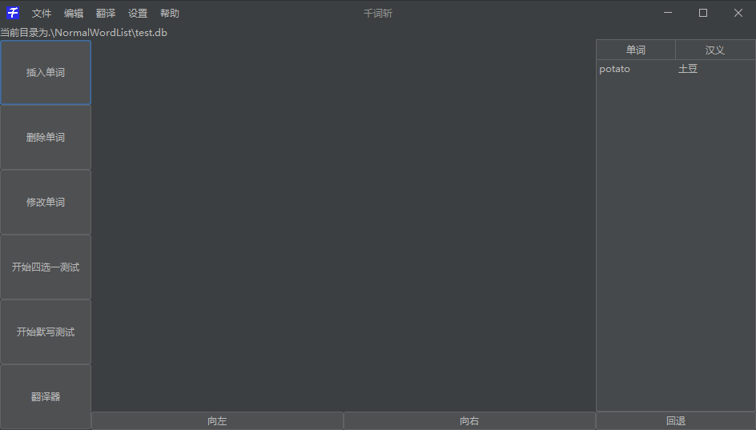

结合本软件的设计初衷，我们可能会遇到不知道输入单词的汉义的情况，此时可以在插入单词对话框点击`翻译`按钮，软件便可以自动给出输入单词的汉义。但是并不推荐这样做，最好的做法是空下不知道的汉义，在所有单词全部录入完成后点击`编辑`菜单栏的`补全单词汉义`，千词斩会自动补全所有空下的汉义（注：翻译功能需要联网才能使用）。

在右侧单词列表单击单词即可预览单词的基本信息。下方的`向左`、`向右`按钮用于跳转到上一个或下一个单词。

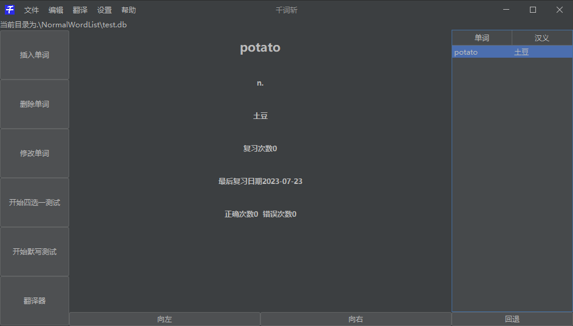

若发现录入单词信息有误，在选中单词后点击左侧的`修改单词`即可弹出修改单词对话框，其用法与插入单词一致。

若想删除单词，在选中单词后点击左侧的`删除单词`即可删除单词。

上述插入、修改和删除单词的操作也可以使用`编辑`菜单栏中的对应菜单项实现。

## 测试

千词斩提供了默写测试和四选一测试两种测试方法。若想使用测试，在进入单词本后点击左侧对应的测试按钮即可。

在进入单词本后点击左侧的`四选一测试`即可开始开始四选一测试，其界面如图。

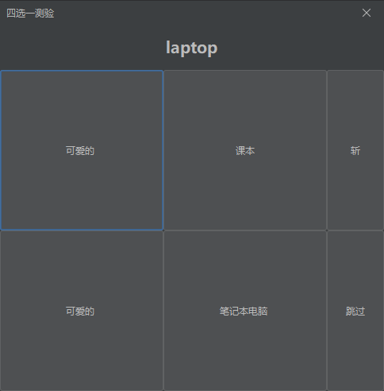

四选一测试需要您根据给出的单词选出其正确的汉义。右侧的`斩`和`跳过`用于斩掉（斩掉的单词在后续测试中不会再出现，但是该功能尚未实现）或者跳过单词。

在完成测试后会弹出如图所示的界面。关闭后选中单词本中的单词，会发现其复习次数和日期已被刷新。

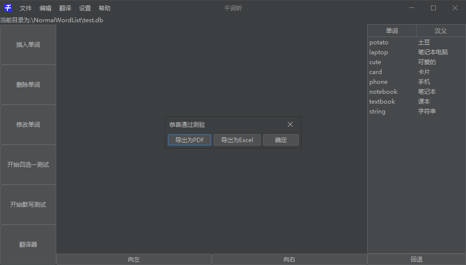

在进入单词本后点击左侧的`默写测试`即可开始开始默写，其界面如图。默写测试需要您根据给出的汉义默写单词。点击`提示`可以给出单词的部分拼写，其效果如图。

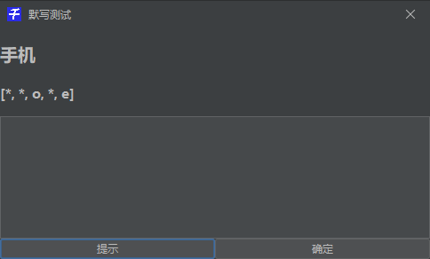

## 工具

千词斩提供了一系列便捷工具。

### 翻译器

点击左侧`翻译器`即可打开翻译器。也可以点击`翻译菜单`中的`打开翻译器`以打开翻译器。翻译器提供了汉译英和英译汉两种模式，在`翻译源`输入需要翻译的内容后点击翻译即可（注：翻译功能需要联网才能使用）。

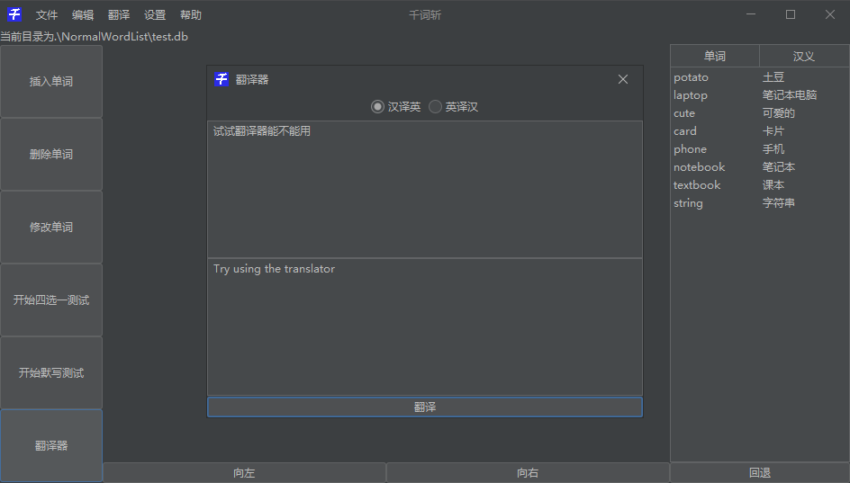

### 导出单词本

在进入单词本后，点击`文件`菜单中的`导出为PDF`即可将单词本导出为PDF文件。

注：该功能需要安装MikTex才可使用。

在点击`导出为PDF`后稍等片刻直至出现导出完成对话框，如图。随后在千词斩目录同级的`OutputList`文件夹中即可找到导出的PDF文件。

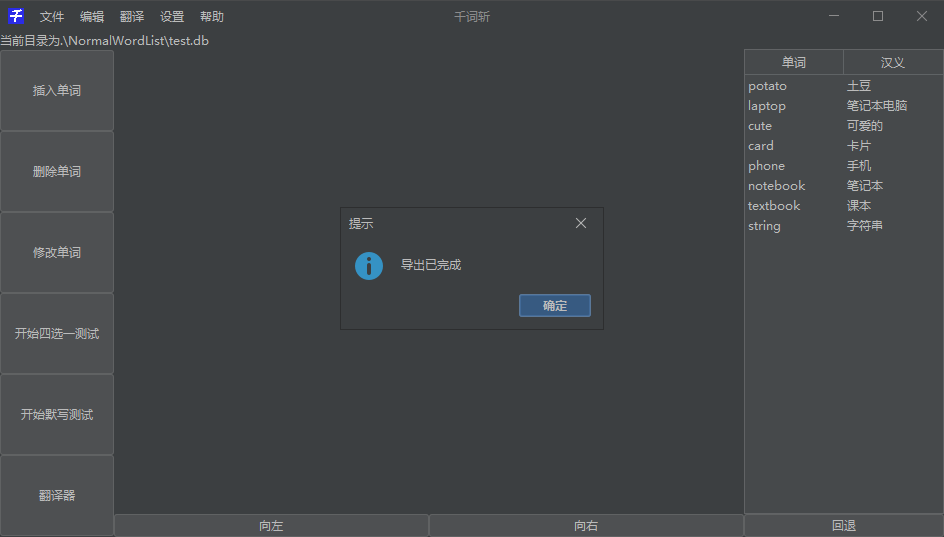

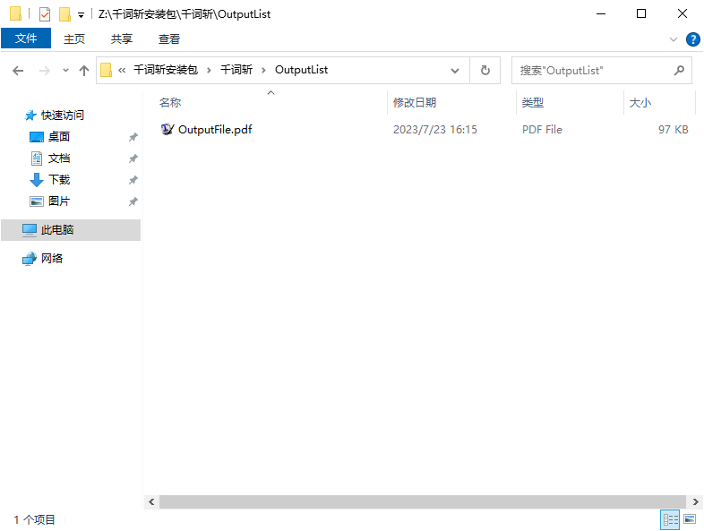
